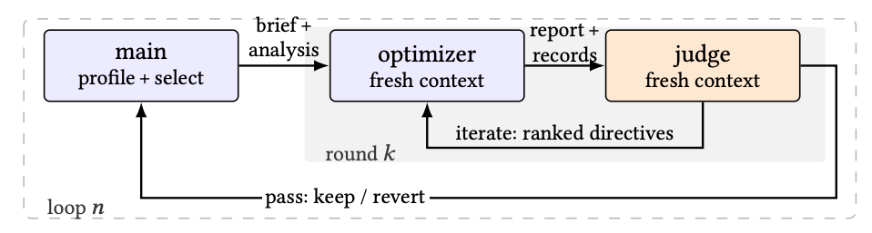
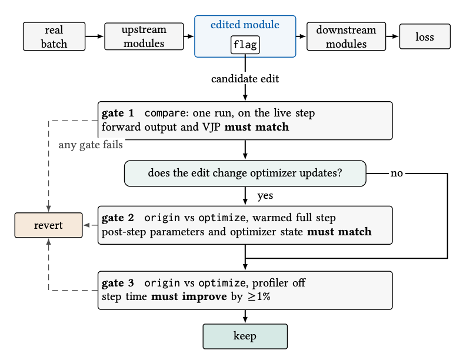

# Talos

**T**orch **A**cceleration through a **L**oop-Driven **O**ptimization **S**kill.

Talos is a set of skills that let a coding agent (Claude Code, Codex) speed up a
PyTorch workload the way a performance engineer would: profile the real run,
find where the time actually goes, change one thing, measure whether it helped,
keep it or throw it away, repeat.

You point it at your training or inference code and tell it how to run. It drives the profilers, reads the traces, rewrites the hot spots, and verifies every change end to end. What you get back is a series of reviewed, measured changes.

Nothing is guessed. Every kept change has a profiler-off before/after number
behind it.

## Install

Talos ships as a platform-specific wheel, because it bundles the `veloq` binary.
Pick the one matching your machine — `manylinux2014_x86_64`,
`manylinux2014_aarch64`, `macosx_11_0_x86_64` or `macosx_11_0_arm64`.

**From a released wheel:**

```bash
pip install talos-0.1.0-py3-none-manylinux2014_x86_64.whl
```

**Building it yourself**, if there is no wheel for your platform or you are
working on Talos itself:

```bash
git clone <repo> && cd talos
make install-wheel          # build for this host, then pip install it
```

`make build` alone leaves the wheel in `dist/` without installing it; add
`ALL=1` to build for every supported platform, or `PLATFORM=aarch64-linux` for
one specific target. Building downloads the matching `veloq` release, so it
needs network access. `make help` lists everything.

Either way, link the skills into the project you want to optimize:

```bash
cd /path/to/your/project
python -m talos.install_skills claude      # or: codex
```

This creates `./.claude/skills/<skill>` symlinks pointing at the installed
package, so upgrading Talos upgrades the skills. Re-running is idempotent.

## What's in the box


| Skill                   | What it does                                                                                                                                                                                               |
| ----------------------- | ---------------------------------------------------------------------------------------------------------------------------------------------------------------------------------------------------------- |
| `torch-optimize`        | The optimization loop. Profiles your workload, picks the hotspot with the most step-time impact, dispatches it to a focused subagent, and judges the result before keeping it. This is the one you invoke. |
| `torch-perf-analysis`   | Turns an nsys trace of a PyTorch run into structured evidence: per-step GPU utilization, which source line each kernel came from, where the GPU sat idle and who made it wait.                             |
| `nsys-profile-analysis` | Timeline questions on any `.nsys-rep` — idle gaps, launch causes, CPU/GPU correlation, CUDA graphs.                                                                                                        |
| `ncu-profile-analysis`  | Why one kernel is slow internally — occupancy, warp stalls, memory vs instruction bound.                                                                                                                   |


The last two are bundled from [veloq](https://github.com/lucifer1004/veloq), the
profile-query CLI Talos uses under the hood. `pip install talos` puts the
`veloq` binary on your PATH.

## Using it on a real project

The only thing you write is a `user_guide.md`. It is the single input Talos
takes — everything it needs to know about your workload lives in this one file.
Talos instruments your code and captures the traces itself, but it will not
guess where your code is, how to run it, or what you care about.

Three sections are required, two more are worth adding when they apply:

````markdown
# User guide

## Working directory

`src/`

All commands below are run from here, and this is the PyTorch package to
optimize.

## How to start

```bash
python3 train.py \
  --config configs/base.yaml \
  --batch-size 64 \
  --seq-len 1024 \
  --steps 200
```

## How to stop

Wait for the training process to finish, or use `ps` to find the pid and
`kill` it. No checkpoints are written, so killing it is safe at any point.

## Focus guidance — encoder attention

**Goal: 2x lower the end-to-end latency, compared to the baseline.**

The 16 encoder layers are structurally identical and the GPU looks underfed
through them, so start there: launch overhead and kernel fusion are the
likely levers. `torch.compile` over the attention block is fair game, as are
custom FlashAttention variants.

Out of scope: the data pipeline (`src/data/`) and anything under
`src/serving/`.

## Attention

- Sequence length varies from 128 to 2048 in production. Benchmark
  representative buckets rather than only the captured shape.
- The loss must stay bit-identical — no approximating the softmax.
````

**Working directory** *(required)* — the path holding the code to optimize.
Talos creates its `.torch_optimize/` workspace here, and every command in the
guide is interpreted relative to it.

**How to start / How to stop** *(required)* — these are the commands Talos uses for the baseline
capture and for every before/after measurement, so they have to run unattended:
anything that prompts for input, needs a password, or never exits will stall the
loop. Give the rough step time and memory too — it is how the agent notices when
a measurement looks wrong.

**Focus guidance** *(optional)* — where you steer. State the goal as a number,
say which part of the stack you believe is worth attacking, and — most usefully
— say what is off limits. Talos ranks hotspots by measured impact anyway, but
this is what breaks the tie between similar candidates.

**Attention** *(optional)* — constraints that are invisible in the code: shape
distributions a single capture will not show, numerical tolerances, memory
ceilings.

Two working examples ship with Talos: `[examples/hstu/user_guide.md](examples/hstu/user_guide.md)`
and `[examples/onerec/user_guide.md](examples/onerec/user_guide.md)`.

## Starting a run

One argument: the guide you just wrote.

**Claude Code**

```bash
cd /path/to/your/project
claude
```

Then in the chat box:

```
/torch-optimize path/to/your/user_guide.md
```

**Codex**

```bash
cd /path/to/your/project
codex
```

Then in the chat box:

```
$torch-optimize path/to/your/user_guide.md
```

From here Talos runs on its own. It creates a `.torch_optimize/` workspace under
the working directory, and every profile, patch, report and verdict lands in
there for you to read.

---

# How it works


## The loop

Optimization is not a single pass. Talos splits the work across three roles that
talk to each other only through files, so no context is shared and no role can
quietly rationalize a bad result.

**Main Loop Agent** — owns the whole run. Profiles the workload, ranks hotspots
by how much step time they actually cost, and dispatches one at a time. It never
edits your code itself.

**Optimizer** — a fresh subagent per round, given exactly one hotspot. It works
in a disposable context: rewrite, check correctness, re-measure, and report. Its
scratch reasoning stays in its own round folder and never pollutes the main
thread.

**Judge** — a fresh subagent per finished round, which sees the evidence but not
the Optimizer's reasoning. It independently decides whether the claimed win
holds up, and returns either `ITERATE` (with ranked directives for another
attempt) or `PASS`.



A loop picks one hotspot and keeps handing it to fresh Optimizer contexts until
the Judge is satisfied or gives up. Nothing is carried between rounds except the
files on disk — the brief and analysis going in, the report and records coming
out.

The separation is the point. The agent that made a change is not the agent that  
decides whether to keep it.

## Validating a change

Before a change is kept it has to prove two things: that it did not alter the
model's numerics, and that it actually made the step faster. Every edited module
keeps both code paths behind a flag, so the original is never lost and the two
can be run against each other on the real batch — not on a synthetic test.



A change has to clear three gates: forward output and gradients must match the
original, optimizer state must match too if the edit could affect updates, and
the step time must actually improve. Any gate failing reverts the edit.

## Requirements

- Python ≥ 3.10
- PyTorch — whatever your project already uses; not installed by Talos
- `pyarrow` ≥ 14 — installed automatically
- A C++17 compiler and the CUDA toolkit matching your PyTorch build, for the
profiling observer and for optimizations that lower code to C++
- `nsys` ≥ 2024.6 on PATH for capture
- `jq` — optional, only for the bundled veloq skills' example commands

A ready-made image with all of this is in [docker/](docker/).

## Results

Four recommendation models, each optimized end to end by Talos with no human
in the loop:

| Model | Step time (ms) | Speedup | Loops kept / run | Tokens |
|---|---|---|---|---|
| DIN | 61.55 → 27.67 | 2.22× | 6 / 9 | 192 M |
| DIEN | 64.36 → 19.56 | 3.29× | 5 / 7 | 155 M |
| HSTU | 615.89 → 194.87 | 3.16× | 4 / 5 | 66 M |
| OneRec | 613.06 → 275.78 | 2.22× | 6 / 7 | 295 M |

Step times are profiler-off medians of the real training command. **Loops kept /
run** is how many optimization loops survived the Judge out of how many were
attempted — roughly a third get thrown away, which is the point.
