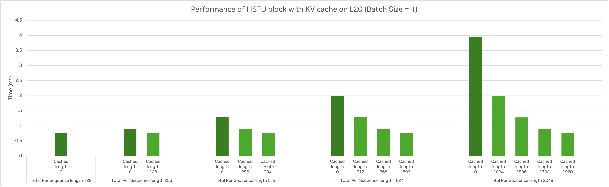
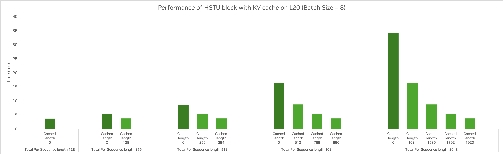

# Benchmark

We provide two sets of benchmarks:
* [Fused HSTU layer benchmarks](#fused-hstu-layer-benchmark)
* [Inference benchmarks](#hstu-inference-benchmark) on end-to-end inference and paged HSTU inference layer 

# Fused HSTU layer benchmark

In hstu example, we have provided a set of performance optimization guidelines for single HSTU layer, including
1. Fast and memory-efficient hstu attention integration.
2. Kernel fusions (with triton).
3. Seletive forward recompute.

You can run script `run.sh` to see the performance over native implementation. The baseline (native implementation) is 
1. With triton-based hstu attention kernels
2. No kernel fusions.
3. No recompute.

## How to run
The test entry is `python ./benchmark/fused_hstu_layer_benchmark.py run`, you can type `python ./benchmark/fused_hstu_layer_benchmark.py run --help` to get the input arguments. 2 important arguments are :
1. --layer-type: whether to enable fusions. Could be `fused` or `native`.
2. --kernel-backend: select the hstu mha backend. Could be `triton` or `cutlass`.

Our baseline cmd example (1K): 
```bash
python ./benchmark/fused_hstu_layer_benchmark.py run \
  --iters 100 \
  --warmup-iters 50 \
  --layer-type native \
  --kernel-backend triton \
  --dim-per-head 256 \
  --num-heads 4 \
  --num-layers 1 \
  --dtype bfloat16 \
  --max-seqlen 1024 \
  --full-sequence True \
  --batchsize 32 
```

You can also run a set of arguments with run.sh:
```bash
RECOMPUTE_INPUT_SILU=True RECOMPUTE_INPUT_LAYERNORM=True bash run.sh <num_layers>
```
Since recompute helps reduce activation memory usage but incurs latency increase, you can use env `RECOMPUTE_INPUT_SILU, RECOMPUTE_INPUT_SILU` to decide whether to enable the input layernorm and the first silu following uvqk linear.

After one run is done, a memory snapshot file in current working directory is generated, you can trace the memory usage with the file. Please refer to [PyTorch docs](https://docs.pytorch.org/docs/stable/torch_cuda_memory.html) on how to visualize the memory trace.

## Benchmark results

We cover sequence from 1k~8k, other hyper-params are as followed:
| Item          | Value |
| ------------- | ----- |
| Batchsize     | 32    |
| dim per head  | 256   |
| num_heads     | 4     |
| embedding dim | 1024  |

All results are conducted on single H100-SXM5-80G
### Latency

| seqlen | Baseline (ms) | + cutlass kernel | +fusion | +layer norm recompute (ms) | +silu recompute (ms) |
| ------ | ------------- | ---------------- | ------- | -------------------------- | -------------------- |
| 1K     | 6.6515        | 5.8640           | 3.8854  | 3.9271                     | 4.1149               |
| 2K     | 16.0452       | 12.9900          | 9.1797  | 9.2780                     | 9.7622               |
| 4K     | 44.3293       | 31.7074          | 24.5428 | 24.7954                    | 25.5000              |
| 8K     | 137.9320      | 88.3084          | 74.7734 | 74.8163                    | 76.3875              |

The columns other than the first column are incrementally tested based on the previous column.

### Peak memory
We trace the peak memory with the help of torch memory snapshot. To better identify the boundary forward and backward process, we have run 2 HSTU layers.
Below are the memory usage for seqlen=4K:


# HSTU Inference benchmark

## Key Features

1. Cache for KV data

We use GPU memory and host storage for KV data cache., as in `GpuKVCacheManager` and `HostKVStorageManager`. This can help to reduce the recomputation of KV data.

The GPU KV cache is organized as a paged KV-data table, and supports KV data adding/appending, lookup and eviction. When appending new data to the GPU cache, we will evict data from the oldest users according to the LRU policy if there is no empty page. The HSTU attention kernel also accepts KV data from a paged table.

The host KV data storage support adding/appending and lookup. We only present an example implementation, since this can be built over other database and can vary widely in the deployment.

2. Asynchronous H2D transfer of host KV data 

By using asynchronous data copy on the side CUDA stream, we overlap the host-to-device KV data transfer with HSTU computation layer-wise, to reduce the latency of HSTU inference.


3. Optimization with CUDA graph

We utilize the graph capture and replay support in Torch for convenient CUDA graph optimization on the HSTU layers. This decreases the overhead for kernel launch, especially for input with a small batch size. The input data (hidden states) fed to HSTU layers needs paddding to pre-determined batch size and sequence length, due to the requirement of static shape in CUDA graph.

## How to run

1. Build TensorRT-LLM (with HSTU KV cache extension):

The HSTU inference utilize customized KV cache manager from TensorRT-LLM.
The current version is based on the HSTU specialized implementation based on TensorRT-LLM v0.19.0.
```bash
~$ cd ${WORKING_DIR}
~$ git clone -b hstu-kvcache-recsys-examples https://github.com/geoffreyQiu/TensorRT-LLM.git tensorrt-llm-kvcache && cd tensorrt-llm-kvcache
~$ git submodule update --init --recursive
~$ make -C docker release_build CUDA_ARCHS="80-real;86-real"
# This will build a docker image with TensorRT-LLM installed.
```

2. Install the dependencies for Recsys-Examples.

Turn on option `INFERENCEBUILD=1` to skip Megatron installation, which is not required for inference.
```bash
~$ cd ${WORKING_DIR}
~$ git clone --recursive -b ${TEST_BRANCH} ${TEST_REPO} recsys-examples && cd recsys-examples
~$ TRTLLM_KVCACHE_IMAGE="tensorrt_llm/release:latest" docker build \
    --build-arg BASE_IMAGE=${TRTLLM_KVCACHE_IMAGE} \
    --build-arg INFERENCEBUILD=1 \
    -t recsys-examples:inference \
    -f docker/Dockerfile .
``` 

3. Run the benchmark.

```bash
~$ cd recsys-examples/examples/hstu
~$ export PYTHONPATH=${PYTHONPATH}:$(realpath ../)
~$ python3 ./benchmark/inference_showcase.py
~$ python3 ./benchmark/paged_hstu_with_kvcache_benchmark.py
``` 

## Benchmark results

Here we present the benchmark results of the HSTU layers with KV cache on single L20 gpu.

HSTU Setup for benchmark:

| Parameter | Value |
|-----------|-------|
| Number of HSTU layers | 8 |
| Hidden Dim Size | 1024 |
| Number of Heads | 4 |
| Head Dim Size | 256 |
| Max Batchsize| 16 |
| Max Per Sequence Length | 4096 |
| Per Sequence Targets Number | 256 |

### 1. End-to-end inference performance

Here we benchmarked with a synthetic input dataset:
* Each user's input sequence starts from 256 tokens to 4096 in increments of 256.
* Each input request has 256 item candidates for ranking.
* Generate data for 1, 2, 4 and 8 users to benchmark with different batch size. 

We can achieve **1.4x ~ 2.7x** performance speedup for inference (with batch size ranging from 1 to 8), after utilizing the KV cache and CUDA graph optimization.

Performance results:


### 2. HSTU block performance

Performance Results:




When the input sequence has 2048 tokens in which 1920 tokens have KV data cached, we can achieve **5x ~ 10x** performance speedup on HSTU block (for batch size = 1 and 8 respectively).