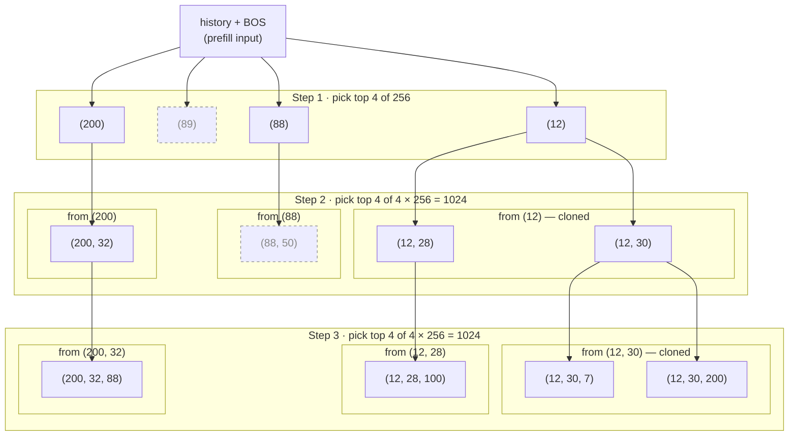
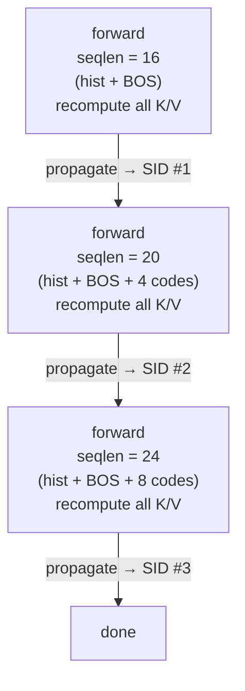
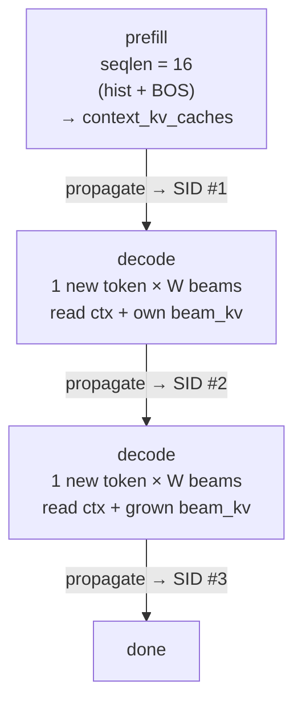

# Semantic ID Generative Recommender Example

## Getting Started

- **Training**: See the [SID-GR training example](./training/README.md) for detailed instructions

## Introduction

**Semantic ID (SID)** based representation addresses the limitations of traditional item representations by tokenizing and quantizing items into a structured semantic space. The key innovation is that items with similar semantic meanings are mapped to nearby positions in the discrete ID space, creating a hierarchical and interpretable item vocabulary. This design offers several advantages:

- **Semantic coherence**: Items with similar features or user preferences are assigned close semantic identifiers, enabling better generalization
- **Cold-start mitigation**: New items can be mapped to the semantic space based on their content features, reducing dependency on historical interactions
- **Generation efficiency**: With semantic IDs and optimized beam search implementations, the model can retrieve large numbers of candidates at the cost of only a few decoding steps
- **Scalability**: Hierarchical codebook structures (e.g., multi-level quantization) replace high-cardinality flat embedding tables, significantly reducing communication and storage resource requirements while enabling efficient representation of large item catalogs

This example implements a Semantic ID based Generative Recommender (SID-GR) that combines the strengths of semantic item representations with powerful sequence modeling capabilities. The model backbone uses a standard self-attention decoder architecture, and we have integrated Megatron-Core to leverage its diverse parallelism capabilities.

## Data Representation

In this model, each unique PID (Product ID) is mapped to a fixed-length tuple of semantic identifiers. The number of hierarchies (i.e., tuple length) and the cardinality per hierarchy are determined by the user. To obtain semantic meanings, item information is encoded through an LLM into embeddings, followed by a quantization process. Quantization methods include RQ-KMeans, RQ-VAE, etc. See the diagram below:

  

The mapping process can be handled offline and separately, decoupled from GR training. **This preprocessing step is not covered by this example.** Our work focuses solely on sequential GR training and inference. To ensure compatibility with previously processed sequential datasets, we save the processed PID-to-SID mapping as a PyTorch tensor file. During training, we load both the historical sequential dataset and the mapping tensor(s), performing on-the-fly conversion from PIDs to SIDs without any additional preprocessing of the historical dataset files.

### PID-to-SID Tokenization

We use [GRID](https://github.com/snap-research/GRID) to tokenize item product IDs into SID identifiers. After tokenization, the mapping tensor should have shape `[num_hierarchies, num_unique_items]`. To convert PID `p` to SIDs, simply index `mapping[:, p]`. This tensor is loaded by the dataloader. In cases where the number of unique items is extremely large, the mapping tensor can be chunked into multiple tensors.

### Special Tokens

In addition to normal SID tokens, a special `<BOS>` (Beginning of Sequence) token is prepended to each item SID tuple when that item is involved in loss computation. This is performed during the model forward pass.

**Example:** Given raw history item SIDs consisting of 3 items: `[s1, s2, s3; s4, s5, s6; s7, s8, s9]`

- **Last item used for loss**: Transformed to `[s1, s2, s3; s4, s5, s6; bos, s7, s8, s9]`
  - Using next-token prediction, tokens `bos, s7, s8` predict `s7, s8, s9` for cross-entropy loss computation
  
- **Last 2 items used for loss**: Transformed to `[s1, s2, s3; bos, s4, s5, s6; bos, s7, s8, s9]`

The diagram below illustrates the loss computation logic:

  

## Embeddings

Unlike traditional generative recommendation models that assign a unique embedding vector to each item (creating an extremely large and sparse embedding space), SID-based generative recommendation models only require multiple independent small tables. Since the vocabulary size of these tables typically ranges from a few hundred to a few thousand, we adopt a data-parallel strategy to distribute these tables.

Specifically, we only need to create $\sum_{h \in H} C_{h}$ embedding vectors, where $C_{h}$ is the maximum capacity of hierarchy $h$. Both $H$ (number of hierarchies) and $C_{*}$ (capacities) are determined during the tokenization step. 

## Decoder Stack

The model uses a standard Transformer decoder architecture, implemented using the Megatron-Core Transformer block for efficient parallel processing.

## Prediction Head

The prediction head is typically an MLP layer. Due to the hierarchical structure of SIDs, we support two configurations:

1. **Shared prediction head**: A single head is shared across all hierarchies
   - Training loss labels range from $0$ to $\sum_{h \in H} C_{h} - 1$
   
2. **Per-hierarchy prediction heads**: Each hierarchy has its own dedicated prediction head
   - Tokens from the $h$-th hierarchy pass through the $h$-th prediction head
   - Label range for each hierarchy: $0$ to $C_{h} - 1$

The choice between these two paradigms is controlled by [`NetworkArgs.share_lm_head_across_hierarchies`](./configs/sid_gin_config_args.py).

## Beam Search Generation

The SID-GR model performs retrieval through beam search generation. To retrieve $N$ candidates, the process involves $H$ steps of beam search, where the final step's beam width equals $N$. Compared to traditional LLMs, SID-GR has distinct characteristics:

1. **Predetermined and small number of steps**: 
   - In LLMs, generation length is not predetermined and continues until certain criteria are met
   - In SID-GR, the number of steps always equals the number of hierarchies ($H$), which is typically small (e.g., 3-5)

2. **Much larger beam width**:
   - LLMs use beam search primarily for diversity, typically with beam width < 10
   - Recommender systems require retrieving hundreds or thousands of candidates, necessitating much larger beam widths

These two characteristics necessitate different performance optimization strategies compared to LLM inference.

The diagram below walks through one full generation for `H=3` hierarchies, `beam_width=4`, and `codebook_size=256` (the per-hierarchy SID vocabulary). Each step expands every surviving parent over the next 256-way codebook — so step 2 / step 3 search a `4 × 256 = 1024` space — and keeps the top 4 children. Children are grouped by their parent; a group tagged `cloned` means that parent contributed multiple children. Dashed nodes were pruned (their descendants didn't make top-K next step).

The four leaves at the bottom are the recommended SID tuples for this sample.

### Generation APIs

The model exposes two generation entry points, both producing top-K beams of full SID tuples. The diagram below contrasts the per-step work (example shapes: `hist=15`, `BOS=1`, `W=4`, `H=3`):

<table width="100%">
<tr>
<th width="50%" align="center"><code>generate()</code> — no KV cache</th>
<th width="50%" align="center"><code>generate_beam_decode()</code> — KV cache</th>
</tr>
<tr>
<td width="50%" align="center">

</td>
<td width="50%" align="center">

</td>
</tr>
</table>

`generate()` reruns the full transformer over a growing `[hist + already-generated]` sequence at every step. `generate_beam_decode()` pays the history cost once during prefill and then each decode step runs only the new token per beam, attending into the cached K/V.

1. **`generate()`** — baseline path. At every hierarchy step it re-runs the transformer over `[history + generated_prefix]` with a beam-isolating attention mask so beams do not cross-attend within a step. Works with either decoder backend (Megatron-Core `TransformerBlock` or `JaggedTransformerBlock`). Per-step cost grows with the running prefix length.

2. **`generate_beam_decode()`** — KV-cache path. Runs a single prefill over `[history + BOS]` to populate a per-layer context K/V cache, then performs incremental beam decode using the `beam_decode_attn` kernel. The fixed context K/V is shared across beams; per-step beam K/V is appended to the cache and parent-beam ancestry is tracked through `topk_indices` rather than by reshuffling the cache. Requires `use_jagged_flash_attn=True`; the kernel is vendored at [`corelib/gr_decode_atten/`](../../corelib/gr_decode_atten/) and is on `PYTHONPATH` automatically in the Docker image. Per-step decode no longer reruns the full transformer over the growing prefix — context-side attention remains linear in history length, but full-prefix recomputation at every hierarchy step is avoided, which is where the long-history speedup comes from.

The KV cache in `generate_beam_decode()` is split into two parts, with different sharing and indexing semantics:

  

The diagram is conceptual: rows = beams, columns = decode steps. In memory `beam_kv_caches[ℓ]` is flattened step-major — each decode step appends `W` new K/V rows after the previous step's rows.

`context_kv_caches[ℓ]` is a single per-layer slab populated by prefill and read every decode step by every beam; no per-beam indexing. `beam_kv_caches[ℓ]` is a 2-D conceptual grid (decode step × beam slot) that grows by `W` rows per decode step; per-beam ancestor lookup walks `parent_indices` backwards and is fed to the kernel as `topk_indices`. This split is what keeps the kernel from re-shuffling the cache after each beam-search pruning and what avoids replicating history `W` times.

For backend selection (`backend="3kernel"` vs `"dsl"`), jagged-vs-dense context K/V (`use_jagged_kv`), kernel dependency notes, and measured numbers, see [`benchmark/RESULTS.md`](./benchmark/RESULTS.md) and [`training/README.md`](./training/README.md).

## References

- [Tiger: A Database System for Large-Scale Embedding Retrieval](https://arxiv.org/abs/2305.05065)
- [GRID: Generative Retrieval with Identifiers](https://arxiv.org/abs/2507.22224)
- [OneRec: A Generative Recommender](https://arxiv.org/abs/2506.13695)
- [OpenOneRec GitHub Repository](https://github.com/Kuaishou-OneRec/OpenOneRec)
- [T5 Model Documentation (Hugging Face)](https://huggingface.co/docs/transformers/v4.57.3/en/model_doc/t5#t5)